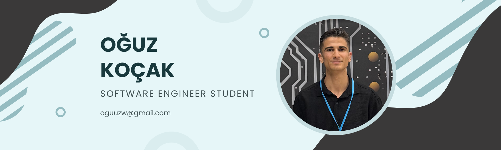

# Hi, I'm Oğuz 

**Konya Technical University | Software Engineering (3rd Year)**

Software Engineering student focused on **Machine Learning** and **Data Science**.

Currently learning **Python, Scikit-learn, and TensorFlow**.

 

## Technologies I've Used

| Area                      | Technologies                               |
| :------------------------ | :----------------------------------------- |
| **Programming Languages** |       |               |
| **Tools**                 |       |

 

## Contact
   [oguuzw@gmail.com](mailto:oguuzw@gmail.com) 

  [www.linkedin.com/in/oğuz-koçak](https://www.linkedin.com/in/oğuz-koçak) 
